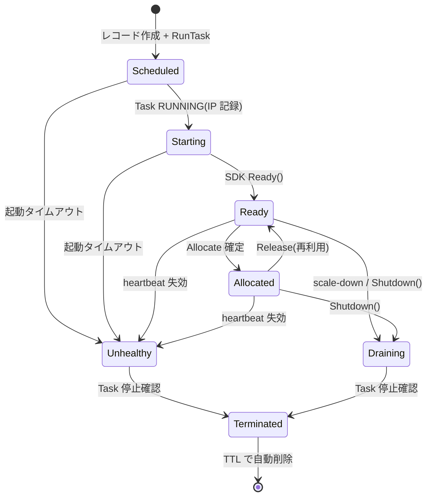
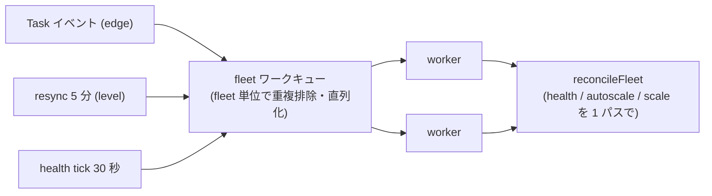

# システムアーキテクチャ

arena の論理設計を説明します。物理的な AWS リソースとの対応は
[aws-resources.md](aws-resources.md) を参照してください。

## 設計原則

1. **Source of Truth は 1 つ** — 永続状態はすべて単一のデータストア(SoT)に置き、
   キャッシュ/キュー側には**再構築可能な派生データだけ**を置く。
   「miss したら他方へ」というフォールバックパスを持たない
2. **状態遷移はすべて条件付き書き込みで状態機械を強制** — 競合は
   「起きたら拒否して reconcile に任せる」
3. **edge トリガ + level トリガ** — イベントで即座に反応し、定期 resync が
   取りこぼしを拾う(Kubernetes informer と同じ収束モデル)
4. **書き込み主体を絞る** — Sidecar は Gateway 経由でのみ書き込み、Fleet の変更は
   単一リーダーの直列キュー。分散ロックを不要にする
5. **ホットパスはロックフリー** — アトミックなキュー取得 + 条件付き確定 + 冪等キー
6. **サービスは増やさない** — ステートレス API とリーダー選出されたコントローラの 2 つ

## コンポーネント

### arena-api(ステートレス・水平スケール)

- 外部 API: Fleet CRUD / `ApplyFleet` / GameServer 参照 / Allocation
- **Allocation ホットパス**(後述)
- **SDK Gateway**: Sidecar からの双方向ストリームを終端し、状態遷移・ハートビートを
  代行実行する。Sidecar から見た唯一の通信相手
- レイテンシ要件を持つのはこのサービスだけ

### arena-controller(リーダー選出・シングルライター)

リースによるリーダー選出(TTL 15 秒 / 更新 5 秒)。非リーダーはホットスタンバイ。
リーダーは以下を実行する:

| ループ | 役割 | 周期 |
|--------|------|------|
| Fleet reconciler | desired/actual の差分調整(Task 起動・停止) | イベント駆動 + resync 5 分 |
| Health sweep | ハートビート失効検知 → Unhealthy 化、「Ready なのにプール不在」の自己修復 | 30 秒 |
| Autoscale | Buffer / Schedule ポリシーの replicas 再計算 | reconcile に統合 |
| Event consumer | Task 状態変化イベント(RUNNING / STOPPED)の反映 | push |
| Pool rebuilder | キャッシュ層のフェイルオーバー後にプールを epoch 方式で再構築 | 障害検知時 |

**1 つの Fleet に対する reconcile・autoscale・health 処理は同一ワークキューで直列化**
される(重複排除付きキュー + worker pool。fleet 内直列・fleet 間並列)。
「スケール判断と reconcile が同時に replicas を触る」競合が構造的に起きない。

### SDK Sidecar(Data Plane)

- ゲームサーバーコンテナへ localhost gRPC(:9357)で Agones 互換 SDK を提供
- 上流へは arena-api への **outbound ストリーム 1 本**にすべてを多重化。
  切断時は指数バックオフで再接続し、再接続時に現在状態が再送されるため
  push の取りこぼしは自然回復する
- **データストアへの直接アクセスを持たない**(攻撃面・接続数・スキーマ結合を Data Plane に広げない)

## データモデル

### 永続データ(SoT)

| テーブル | キー | 内容 |
|---------|------|------|
| `fleets` | fleet_id | spec(template / autoscaling / replicas)、status、version |
| `gameservers` | gameserver_id | state、task 参照、IP:Port、labels、version |
| `allocations` | allocation_id(冪等キー由来) | 割り当て記録 |
| `leases` | lease_name | リーダー選出リース |

- すべての更新は `version` 条件付き(楽観ロック)
- `gameservers` は `fleet_id + "State#created_at"` の複合キーで fleet 単位・状態別に列挙できる
- Terminated レコードと古い Allocation は TTL で自動削除

### 派生データ(キャッシュ層)

| 構造 | キー | 役割 |
|------|------|------|
| Ready Pool (Sorted Set) | `pool:{epoch}:{fleet_id}` | 割り当てキュー。score = ready_at(FIFO) |
| Heartbeat | `hb:{gameserver_id}`(TTL 30 秒) | 生存シグナル。**SoT には書かない** |
| Allocation Push (Pub/Sub) | `alloc:{gameserver_id}` | Sidecar への割り当て通知(at-most-once) |
| Pool epoch | `pool:epoch` | プール世代番号。フェイルオーバー時に INCR して旧プールを論理無効化 |

## GameServer 状態機械



このほか、**すべての状態から Terminated へ直接遷移できる**(Task STOPPED イベントによる
停止確認は状態を問わない)。

| 遷移 | トリガ | 実行者 |
|------|-------|--------|
| Scheduled → Starting | Task RUNNING イベント(IP 記録) | controller |
| Starting → Ready | SDK `Ready()` | arena-api (SDK Gateway) |
| Ready → Allocated | Allocation 確定 | arena-api |
| Allocated → Ready | Allocation 解放(再利用) | arena-api |
| * → Unhealthy | ハートビート失効 / 起動タイムアウト | controller |
| Ready/Allocated → Draining | scale-down / SDK `Shutdown()` | controller / gateway |
| * → Terminated | Task 停止確認(STOPPED イベント) | controller |

すべての遷移は「現在 state と version が期待値であること」を条件にした書き込み。
想定外遷移は拒否され、reconcile が収束させる。

## Reconcile ループ



`reconcileFleet` は 1 パスで以下を行う:

1. fleet の全 GameServer を列挙し、状態別に分類
2. **Health sweep**: Ready/Allocated のハートビートを一括確認。失効(grace period 超過)は
   Unhealthy 化 → プール除去 → Task 停止。キャッシュ層が不達のときはスイープしない
   (監視断でサーバーを殺さない)。healthy な Ready がプールに居なければ再追加(自己修復)
3. **起動タイムアウト**: Scheduled/Starting のまま放置されたものを Unhealthy 化
   (RunTask 喪失・Ready() を呼ばないサーバーの回収)
4. **Autoscale**: autoscaling 有効なら desired replicas を再計算して書き込み
5. **scale-up / scale-down**: active(Scheduled+Starting+Ready+Allocated)と replicas の差分を解消。
   scale-down は Ready を古い順に Draining へ(**Allocated は決して落とさない**)。
   scale-up は 1 パスあたりの起動数上限とトークンバケットで平滑化
6. fleet status(total/ready/allocated/starting)を書き戻す

障害処理は **Unhealthy 化 → Task 停止 → STOPPED イベントで Terminated 確定**という
一方向フロー。中間状態で放置されるレコードを作らない。補充は「active 数の不足」として
次の reconcile が自然に行う。

## Allocation ホットパス

フリート単位の分散ロックは使わない。プールのアトミック pop で候補の重複取得を防ぎ、
SoT の条件付きトランザクションを最終防衛線とする:

```
1. 冪等性チェック: 同一 idempotency key の既存 Allocation があればそれを返す
2. プールから候補を 1 台 pop(アトミック、ロック不要)
3. SoT で確定(単一トランザクション):
     - gameservers: Ready → Allocated(state + version 条件付き)
     - allocations: allocation_id の不存在条件付き Put
   → 「片方だけ成功して幽霊 Allocated が残る」ことがない
4. Sidecar へ pub/sub push(best-effort)
```

条件付き失敗は 2 通りに区別される:

- **同一キーの並行再送が先に確定していた** → その結果を返し、pop した候補を
  プールへ戻す(在庫を失わない)
- **候補が Ready を離れていた**(Unhealthy 等)→ 候補を捨てて次へ(上限付きループ)

在庫なしは `RESOURCE_EXHAUSTED`(クライアントはバックオフ再送。冪等キーで安全)。
ラベルセレクタ付き割り当てはスローパス(SoT の fleet 単位インデックスを Query →
フィルタ → 条件付き claim → プール除去)に分岐する。

## Autoscaling

| ポリシー | 動作 |
|---------|------|
| Buffer | `desired = allocated + bufferSize`(または allocated × bufferPercent、最低 1) |
| Schedule | cron エントリのうち**直近に発火したものが勝つ**(24 時間の遡り探索) |
| Webhook | 外部サービスへ POST し、返ってきた replicas を採用(サーキットブレーカー + タイムアウト付き。失敗時は現状維持) |
| Counter | Counter の集計 available capacity を基準にバッファを確保(`desired = ceil((count + buffer - capacity) / capacityPerGS)`) |
| Chain | 複数ポリシーを cron ウィンドウで切り替え(直近アクティブな最初のエントリが勝つ) |

計算結果は min/max でクランプし、version 条件付きで replicas を更新する。

**replicas の所有権**: autoscaling 有効時は reconciler が所有し、ユーザーの
Scale / replicas 指定付き Apply は `FAILED_PRECONDITION` で拒否される
(apply のたびにスケールが巻き戻る事故を型で防ぐ)。

## プール再構築(epoch 方式)

キャッシュ層は派生データなので、フェイルオーバーしても再構築すればよい:

```
1. controller が接続回復を検知
2. ハートビート 2 サイクル分待つ(sidecar が hb を再送するのを待つ)
3. pool:epoch を INCR ── 旧 epoch キーを論理的に無効化
4. SoT から各 fleet の Ready を列挙し、hb が生きているものだけ新 epoch プールへ投入
5. arena-api は pub/sub で epoch 切替を受けて新プールへ移行
```

## 障害耐性

| 障害 | 影響 | 回復 |
|------|------|------|
| arena-api インスタンス障害 | 該当 Sidecar のストリーム切断 | 指数バックオフで別インスタンスへ再接続(ステートレス) |
| controller リーダー障害 | reconcile 停止(割り当ては継続) | スタンバイがリース失効(15 秒)で昇格。graceful shutdown 時はリース明示解放で即昇格 |
| キャッシュ層フェイルオーバー | 割り当て一時失敗 | epoch 方式プール再構築。**データロスなし** |
| GameServer Task 障害 | セッション断絶 | STOPPED イベント(秒)→ Terminated → reconciler が補充 |
| SoT スロットリング | 書き込み遅延 | adaptive retry + `RESOURCE_EXHAUSTED` でクライアントにバックオフさせる |

## スケーラビリティ目標

| リソース | 目標 | 根拠 |
|---------|------|------|
| GameServers / Fleet | 10,000 | 状態遷移時のみ SoT 書き込み(ハートビートはキャッシュ層) |
| Allocations / 秒 / Fleet | 1,000 | プール pop は単発コマンド(単一シャードで 10 万 ops/s 級) |
| Fleet 総数 | 1,000 | fleet 並列 worker pool。超過時は `-shard-count` で consistent hash ベースの fleet シャーディングを有効化し、複数 controller プロセスへ分散 |
| Control Plane | 10,000 req/s | arena-api の水平スケール |
