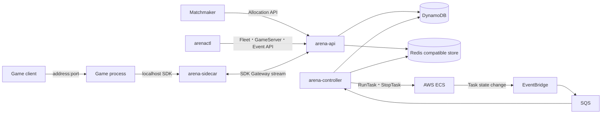

# アーキテクチャ

本ドキュメントは、Arena の実行コンポーネント、データフロー、状態管理、障害時の収束方法を説明する。

## コンポーネント

実行可能ファイルと公開 Go パッケージを、以下にまとめる。

| 対象 | 性質 |
| --- | --- |
| `arena-api` | Fleet、GameServer、Allocation、Event API と SDK Gateway を提供するステートレスなサーバー |
| `arena-controller` | Fleet の収束、オートスケール、ヘルスチェック、ECS event 処理、Redis 復旧処理を実行するコントローラ |
| `arena-sidecar` | GameServer Task に同居し、ローカル SDK と Agones 互換 API を提供する sidecar |
| `arena-router` | 複数のリージョン別 `arena-api` へ Allocation API を転送するステートレスなルーター |
| `arenactl` | Fleet manifest と運用操作を扱う CLI |
| `pkg/sdk` | Arena のローカル SDK を呼び出す Go クライアント |

## データフロー

主要な通信とデータストアの関係を図で表すと、次のようになる。

`arena-api` と `arena-controller` は同じ DynamoDB table prefix と Redis endpoint を使用する必要がある。sidecar は DynamoDB、Redis、ECS API へ直接アクセスしない。

## データ所有権

永続データと派生データの境界を、以下にまとめる。

| 保存先 | データ | 性質 |
| --- | --- | --- |
| DynamoDB | Fleet、GameServer、Allocation、Event、controller lease | 状態判定の基準となる永続データ |
| Redis 互換ストア | Ready pool、heartbeat、Allocation 通知、Counter と List の snapshot | DynamoDB と sidecar から再構築できる派生データ |

GameServer の状態遷移、Allocation の作成、Fleet の楽観ロックには DynamoDB の条件付き書き込みまたは transaction を用いる。Redis 内の古い Ready entry が残った場合も、DynamoDB の条件が非 Ready の割り当てを拒否する。

Redis の疎通が回復すると、controller は待機後に pool epoch を更新し、heartbeat が存在する Ready GameServer から pool を再構築する。Redis 障害中は割り当ての可用性が低下するが、永続状態の正しさは DynamoDB に保持される。

## Fleet の収束

Controller は Fleet ごとに処理を直列化し、異なる Fleet を worker pool で並行処理する。既定では 5 分ごとの全 Fleet resync と 30 秒ごとの health sweep を実行する。SQS を設定した場合は ECS Task event も収束の契機となる。

Controller の既定値は、以下のとおりである。

| 項目 | 既定値 |
| --- | --- |
| leader lease TTL | 15 秒 |
| lease 更新間隔 | 5 秒 |
| worker 数 | 4 |
| 起動 timeout | 5 分 |
| health sweep | 30 秒 |
| Ready 後の heartbeat 猶予 | 60 秒 |
| 1 回の収束で起動する上限 | 50 Task |
| Redis 復旧確認 | 5 秒 |
| Redis 復旧後の再構築待機 | 20 秒 |

`-shard-count` が 1 の場合は 1 個の leader が全 Fleet を処理する。2 以上の場合は Fleet ID の hash で Fleet を固定 shard へ割り当て、shard ごとの DynamoDB lease により複数 controller process へ処理を分散する。Redis 再構築と SQS consumer は primary lease の保持 process だけが実行する。

## 割り当て

Selector を使用しない Allocation は、Redis の Ready pool から最古の Ready GameServer を取り出し、DynamoDB の条件付き transaction で確定する。競合した候補は破棄し、別の候補を試行する。

Selector、Counter filter、priority を使用する場合は、Fleet 内の候補を取得して条件を評価する。`fleet_selector` は同じ namespace 内の Fleet label を評価し、作成日時が古い Fleet から最大 8 Fleet を試行する。解決結果は 60 秒間 cache する。

`idempotency_key` から Allocation ID を決定するため、同じ key の再送は同じ Allocation に収束する。

## Sidecar session

Sidecar は起動時に SDK Gateway へ双方向 stream を開く。stream では heartbeat、状態遷移、metadata、Counter と List の同期を多重化する。切断時は 1 秒から 30 秒までの backoff で再接続する。再接続後に `arena-api` が DynamoDB の現在状態を送信するため、切断中の Allocation 通知を回復できる。

`arena-api -cluster` を指定した場合、sidecar が ECS Task metadata から取得した Task ARN と GameServer ID の組み合わせを、ECS Task の `startedBy` により検証する。

## ローリング更新

Fleet template の hash が変わると generation が増加する。RollingUpdate は `maxSurge` と `maxUnavailable` の範囲で現世代を起動し、旧世代の Ready GameServer を drain する。旧世代の Allocated GameServer はセッション終了を待つ。`drainTimeoutSeconds` を設定した場合は期限後に drain する。

Recreate は旧世代の Ready GameServer を一括で drain してから現世代を起動する。Reserved GameServer は通常の縮小対象にならない。
