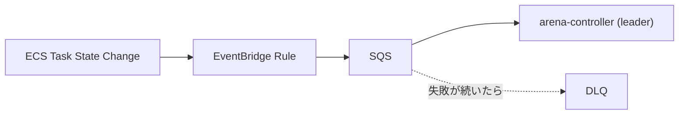
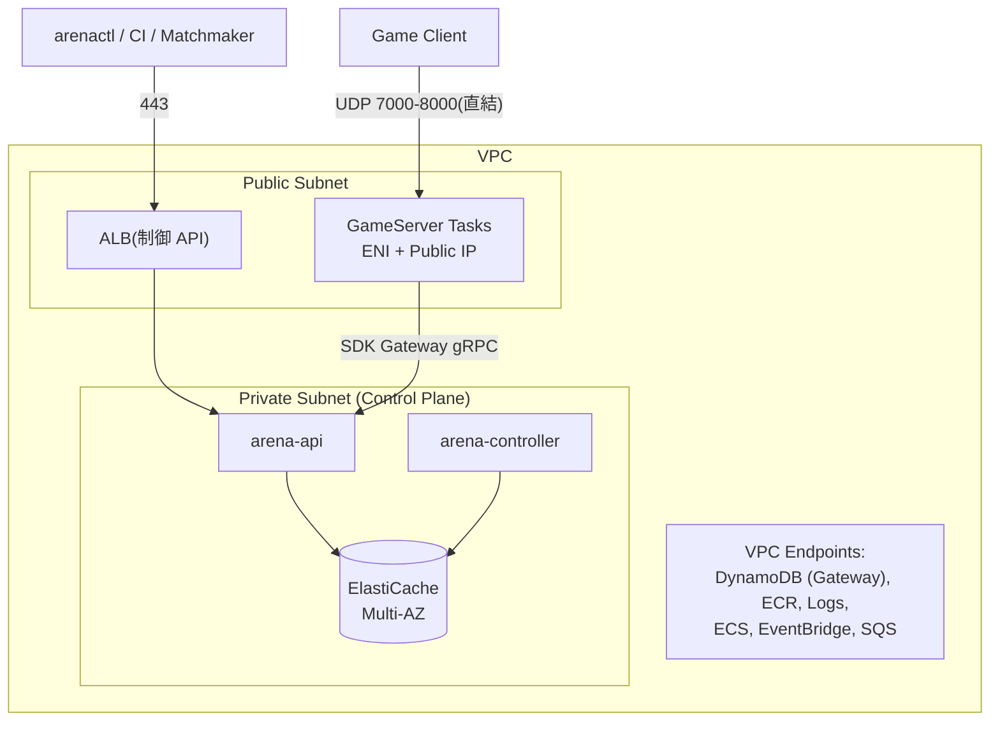

# AWS リソースとの対応

[architecture.md](architecture.md) の論理設計が、実際にどの AWS リソースへ
どう写像されるかを説明します。Kubernetes / Agones の概念との対応も併記します。

## 対応表(概念 → AWS)

| 論理概念 | AWS リソース |
|---------|-------------|
| Source of Truth | **DynamoDB**(4 テーブル、On-Demand) |
| 派生データ(プール / ハートビート / push) | **ElastiCache(Redis 互換 / Valkey)** 1 シャード Multi-AZ |
| GameServer の実行単位 | **ECS Task**(Fargate。EC2 + Capacity Provider も可) |
| Task 状態イベント | **EventBridge**(ECS Task State Change)→ **SQS** → controller |
| Control Plane の実行 | ECS Service(arena-api / arena-controller) |
| 制御系エンドポイント | **ALB** 1 台(TLS 終端、h2c で arena-api へ) |
| ゲームトラフィック | **Task の Public IP へ直結(LB なし)** |
| メトリクス | **CloudWatch EMF**(構造化ログ経由。PutMetricData の API 課金を回避) |
| トレース | OTLP → **ADOT Collector** sidecar → X-Ray 等 |
| 認証基盤 | **AWS IAM / STS**(独自ユーザー DB・API キーなし) |
| 認可設定の配布 | **SSM Parameter Store**(ファイルソースも可) |

## Kubernetes / Agones との対応

| K8s / Agones | arena での置き換え |
|--------------|-------------------|
| CRD (GameServer, Fleet) | DynamoDB テーブル + version 条件付き書き込み |
| Controller / Informer | arena-controller(EventBridge イベント + 定期 resync) |
| etcd の resourceVersion | DynamoDB `version` 属性 + ConditionExpression |
| Leader Election (Lease) | DynamoDB `leases` テーブル(TTL + 条件付き Put) |
| Sidecar Injection | Task Definition 生成時にコントローラが sidecar コンテナを合成 |
| kubectl apply / manifest | `arenactl` + ECS 風 YAML + サーバーサイド Apply |
| Agones hostPort 直結 | awsvpc ENI + Task パブリック IP 直結 |

## DynamoDB

4 テーブル。パーティションキーは UUID で均等分散し、検索系は GSI で fleet 単位に閉じる
(`state` のような低カーディナリティ属性をグローバル GSI の PK にしない —
全 Ready が単一パーティションに集中し 1,000 WCU/partition が全体のボトルネックになるため)。

| テーブル | PK | GSI |
|---------|----|-----|
| `fleets` | fleet_id | `namespace-name-index`: namespace + name |
| `gameservers` | gameserver_id | `fleet-index`: fleet_id + `state_created`("State#created_at" 複合文字列。`begins_with("Ready#")` で fleet 内の Ready 一覧が引ける) |
| `allocations` | allocation_id | `session-index`: session_id / `gameserver-index`: gameserver_id + allocated_at |
| `leases` | lease_name | — |

- 課金モードは **On-Demand で開始**(実測後に Provisioned + Reserved を検討)
- `gameservers` / `allocations` は TTL 属性(`ttl`)有効化。Terminated レコードは 24 時間で自動削除
- **ハートビートは書かない**(10,000 台 × 6 回/分 = 恒常 ~1,000 WCU の浪費を構造的に回避)
- リース取得は `attribute_not_exists OR expires_at < :now OR holder_id = :me` の条件付き Put
- PITR + 日次 On-Demand Backup を推奨。Redis スナップショットは**不要**(全再構築可能)

テーブル定義は Terraform(`deploy/terraform`)が正。ローカル/テスト用には
`store.EnsureTables` が同じスキーマを DynamoDB Local に作成する。

## ElastiCache(Redis 互換)

- 1 シャード Multi-AZ 自動フェイルオーバーで開始
- キー設計(`pool:{epoch}:{fleet_id}`)は hash tag を使わないため、
  Cluster Mode 移行時もフリート単位で自然分散し変更不要
- フェイルオーバー時は controller の pool rebuilder が epoch を進めて再構築
  ([architecture.md](architecture.md#プール再構築epoch-方式))

## ECS

### GameServer Task

- **Task Definition は Fleet の spec_hash ごとに 1 回だけ登録**し再利用
  (GameServer ごとに登録するとリビジョンが爆発する)
- コントローラが sidecar コンテナを合成する。コンテナレベルで sidecar に
  cpu 128 / memory 256 を予約し、残りをゲームコンテナへ割り当てる
  (ゲームプロセスの暴走が sidecar のハートビートを飢えさせない)
- `RunTask` は冪等に呼ぶ:

| フィールド | 値 | 目的 |
|-----------|----|------|
| `clientToken` | gameserver_id | controller 再起動を挟んだ二重 RunTask を ECS 側で防止 |
| `startedBy` | `arena:{gameserver_id}` | イベント・DescribeTasks から GameServer を即特定(task_arn 書き戻しに依存しない孤児 Task 検出) |

- RunTask 失敗時はレコードを Scheduled のまま残す。RUNNING イベントが来なければ
  起動タイムアウトが Unhealthy → 再作成へ導く
- RunTask のレート制限(デフォルト数十 call/s)に備え、scale-up は
  トークンバケット(既定 5/s)+ 1 パスあたりの起動数上限で平滑化
- **Fargate**: 起動が速く運用ゼロ。Placement Strategy は効かないため
  `scheduling: packed` は EC2 モード専用
- Public IP は RUNNING イベントの ENI ID から `ec2:DescribeNetworkInterfaces` で解決

### Control Plane

- arena-api: ALB ターゲットの ECS Service。rolling update(minimumHealthyPercent=100)。
  Sidecar ストリームは切断時再接続で無停止
- arena-controller: Desired Count 2(リーダー + スタンバイ)。シャットダウン時に
  リースを明示解放してスタンバイの昇格を早める

## EventBridge → SQS

- RUNNING / STOPPED を controller が消費し、状態機械へ反映
- 処理失敗はメッセージを残して SQS 再配送に任せる(ハンドラは冪等)。DLQ を後段に置く
- `ListTasks` の全量ポーリング突合は行わない(スロットリングの温床)。
  取りこぼしは resync が拾う

## IAM(最小権限)

| ロール | 権限 |
|-------|------|
| arena-api Task Role | DynamoDB(4 テーブル R/W)、ElastiCache 接続、ecs:DescribeTasks(sidecar 検証) |
| arena-controller Task Role | 上記 + ecs:RunTask / StopTask / RegisterTaskDefinition、ec2:DescribeNetworkInterfaces、iam:PassRole(GameServer 用ロール限定)、sqs:ReceiveMessage / DeleteMessage |
| GameServer Task Role | **CloudWatch Logs のみ**(Sidecar はデータストアに触らない) |

呼び出し元(arenactl / CI / Matchmaker)の認証も IAM に一本化している。
詳細は [api.md](api.md#認証認可) を参照。

## ネットワーク

Security Group:

| SG | ルール |
|----|--------|
| ALB | in: 443 from 許可 CIDR |
| arena-api | in: ALB SG、GameServer SG(SDK Gateway gRPC) |
| arena-controller | outbound のみ |
| GameServer | in: UDP 7000-8000 from 0.0.0.0/0 / out: api SG + Logs のみ |
| ElastiCache | in: 6379 from api SG + controller SG のみ(**GameServer からは不可**) |

### ゲームトラフィックに LB を使わない理由

- NLB のターゲット登録・ヘルスチェック収束は分単位で、「Ready になった直後に
  割り当てたい」ライフサイクルと根本的に合わない
- 数千 Task × UDP のターゲット管理はコスト・quota の両面で非現実的
- クライアントはマッチメイキング経由で接続先を受け取るため、安定 DNS 名や
  負荷分散が不要(Agones の hostPort 直結と同じ理由)
- DDoS 対策が必要なタイトルは Global Accelerator を追加

## コスト最適化

| 項目 | 方針 |
|------|------|
| DynamoDB WCU | 高頻度データ(ハートビート)を SoT に書かない設計自体が最大の最適化 |
| LB | ゲームトラフィックに LB を使わない。制御系 ALB は 1 台のみ |
| メトリクス | EMF 化(API コール課金 → ログ取り込み課金) |
| GameServer 実行費 | Fargate Spot(中断は STOPPED イベント → 自動補充で吸収) |
| VPC Endpoint | DynamoDB Gateway 型(無料)必須。NAT 転送費を回避 |

## ローカルでの代替

ローカル開発・統合テストでは AWS を以下で置き換える
([operations.md](operations.md#ローカル実行) 参照):

| AWS | ローカル |
|-----|---------|
| DynamoDB | DynamoDB Local |
| ElastiCache | Valkey |
| SQS / ECS / STS / EC2 | floci(ECS は実 Docker コンテナ実行) |
