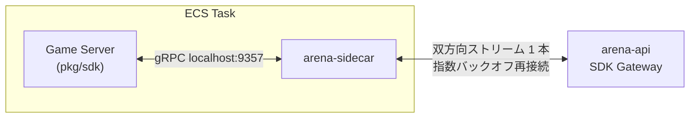
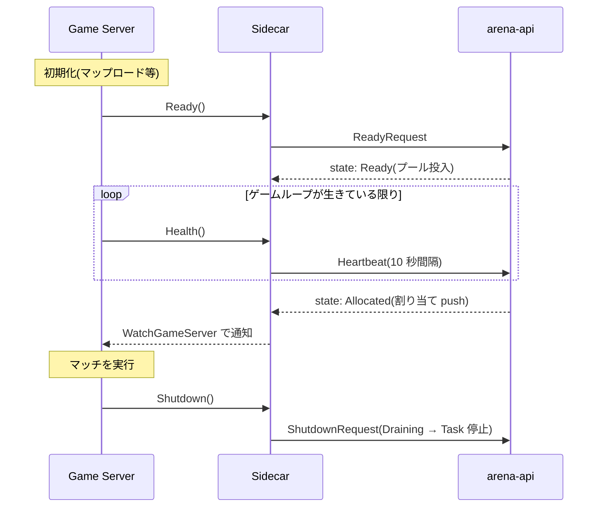

# ゲームサーバー SDK

ゲームサーバーは同一 ECS Task 内の **SDK Sidecar**(`arena-sidecar`)と通信します。
Sidecar は Agones 互換の gRPC API を `localhost:9357` で提供し、上流(arena-api の
SDK Gateway)へは 1 本の双方向ストリームで多重化します。ゲームサーバーが
DynamoDB / Redis / AWS API に触れることはありません。



## ライフサイクル



1. **起動**: sidecar が自動でセッションを張る。ゲームは初期化(マップロード等)を行う
2. **`Ready()`**: 受け入れ可能になったら呼ぶ。サーバーが割り当てプールに入る
3. **`WatchGameServer()` / `GameServer()`**: 割り当て通知(state=ALLOCATED と
   メタデータ)を受け取る
4. **`Health()`**: ゲームループから定期的に呼ぶ(推奨: 数秒間隔)
5. **`Shutdown()`**: セッション終了時に呼ぶ。Task は安全に停止・回収される

## Go SDK(pkg/sdk)

```go
import "github.com/moepig/arena/pkg/sdk"

func main() {
    client := sdk.New() // localhost:9357($ARENA_SDK_ADDRESS で上書き可)
    ctx := context.Background()

    // 初期化が終わったら Ready
    if err := client.Ready(ctx); err != nil { log.Fatal(err) }

    // ヘルスループ(ゲームループが生きている限り呼び続ける)
    go func() {
        for range time.Tick(5 * time.Second) {
            _ = client.Health(ctx)
        }
    }()

    // 割り当てを待つ
    _ = client.WatchGameServer(ctx, func(gs *arenav1.GameServer) {
        if gs.GetState() == arenav1.GameServer_STATE_ALLOCATED {
            startMatch(gs.GetLabels(), gs.GetAnnotations())
        }
    })
}
```

| メソッド | 説明 |
|---------|------|
| `Ready(ctx)` | Starting → Ready(割り当て可能に) |
| `Health(ctx)` | 生存報告(下記「ヘルスの仕組み」) |
| `Shutdown(ctx)` | 終了通知(Draining → Task 停止) |
| `GameServer(ctx)` | 現在の GameServer(IP / ports / labels / 状態) |
| `SetLabel(ctx, k, v)` | ラベル設定(割り当てセレクタの対象) |
| `SetAnnotation(ctx, k, v)` | アノテーション設定 |
| `WatchGameServer(ctx, fn)` | 状態変化のストリーム(割り当て push 含む) |

他言語はネイティブ gRPC クライアントで `arena/v1/sdk.proto` の `SDK` サービスを
`localhost:9357` に対して呼び出してください(Agones SDK と同じ操作モデル)。

### Agones との互換性

`Ready / Health / Shutdown / GetGameServer / SetLabel / SetAnnotation / WatchGameServer /
Reserve / Allocate`(自己割り当て)はすべて Agones と同じセマンティクスで実装済みです。

さらに sidecar は同じ `:9357` で本物の `agones.dev.sdk.SDK` サービスも提供して
いるため、**Unity / Unreal / C# / C++ / Rust / Node など公式 Agones SDK をコード
変更なしに接続できます**。加えて `:9358` に手書きの Agones 互換 REST(HTTP+JSON)
エンドポイントがあり、gRPC クライアントを持たない言語からも利用できます。
Counters/Lists(`agones.dev.sdk.beta.SDK` の `GetCounter` / `UpdateCounter` /
`GetList` / `UpdateList` / `AddListValue` / `RemoveListValue`)も同様にワイヤ互換
です。詳細な機能対応表・既知の差分は [agones-migration.md](agones-migration.md)
を参照してください。

## ヘルスの仕組み

- sidecar は **10 秒間隔**でハートビートを上流へ送る(Redis TTL 30 秒)
- ゲームが一度でも `Health()` を呼ぶと、それ以降 **30 秒以内に次の `Health()` が
  来なければ sidecar はハートビート送信を止める** → controller が失効を検知して
  Unhealthy → Task 停止 → 自動補充。これが「プロセスは生きているがゲームループが
  ハングした」ケースの検知手段です
- `Health()` を一度も呼ばないサーバーは Task 生存のみで健全とみなされる
  (起動直後の grace はサーバー側でも 60 秒確保される)

## 割り当て通知の信頼性

割り当て push は at-most-once です。落ちても:

- sidecar の再接続時に gateway が現在状態を必ず再送する
- `GameServer()` はいつでも最新状態を返す

ため、`WatchGameServer` の受信のみに依存せず、状態(`STATE_ALLOCATED`)で判定してください。

## Sidecar の設定

sidecar コンテナは controller が Task Definition に自動注入します。手動実行時:

| フラグ / 環境変数 | 既定値 | 説明 |
|------------------|-------|------|
| `-listen` | `localhost:9357` | ローカル SDK の listen アドレス |
| `-gateway` / `$ARENA_GATEWAY_ENDPOINT` | — | arena-api の SDK Gateway URL(必須) |
| `-gameserver-id` / `$ARENA_GAMESERVER_ID` | — | GameServer ID(controller が注入。必須) |

- Task ARN は ECS メタデータエンドポイントから自動検出され、gateway での
  なりすまし検証([api.md](api.md#sidecar-の認証別系統))に使われる
- 上流ストリームは切断時に指数バックオフ(1s→…→30s)で再接続する。切断中に
  発行された `Ready()` 等は再接続後に送信される
