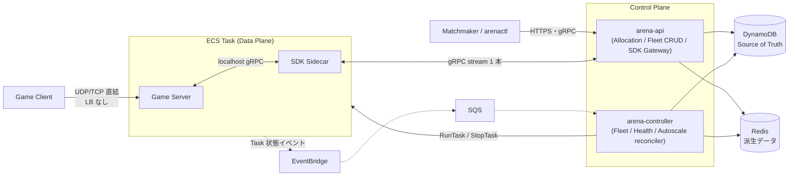

# Arena — ECS Game Server Management System

Arena は Kubernetes [Agones](https://agones.dev/) の機能を **AWS ECS 上で**実現する
ゲームサーバー管理システムです。Kubernetes クラスタを運用せずに、
ゲームサーバーのフリート管理・プレイヤーへの割り当て・オートスケール・
ヘルスチェックを提供します。

## 何ができるか

| 機能 | 説明 |
|------|------|
| Fleet 管理 | ゲームサーバー群を宣言的に定義し、希望台数へ自動収束 |
| Allocation | プレイヤー/マッチメイカーへの低レイテンシなサーバー割り当て(冪等・ロックフリー) |
| Autoscaling | Buffer(割り当て数 + 余裕分)/ Schedule(cron)ポリシー |
| Health | Task 障害(イベント、秒オーダー)+ アプリ層ハング(ハートビート失効、≦60 秒)の二層検知と自動補充 |
| SDK | Agones 互換の gRPC SDK(Ready / Health / Shutdown / Watch など)を sidecar が提供 |
| 宣言的管理 | ECS タスク定義風の YAML + `arenactl apply / diff`(GitOps 対応) |

## アーキテクチャ(要約)



- **DynamoDB が唯一の Source of Truth**。状態遷移はすべて条件付き書き込みで状態機械を強制
- **Redis(ElastiCache/Valkey)は再構築可能な派生データのみ**(割り当てキュー・ハートビート)。失っても正しさは失われない
- **ゲームトラフィックにロードバランサを使わない**。クライアントは割り当てレスポンスの IP:Port に直結
- サービスは 2 つだけ: ステートレスな **arena-api** と、リーダー選出された **arena-controller**

詳細は [docs/arena/architecture.md](arena/architecture.md) を参照してください。

## コンポーネント

| バイナリ | 役割 |
|---------|------|
| `arena-api` | Fleet CRUD / GameServer 参照 / Allocation / SDK Gateway。水平スケール |
| `arena-controller` | Fleet・Health・Autoscale reconciler、イベントコンシューマ、プール再構築。リーダー 1 + ホットスタンバイ |
| `arena-sidecar` | GameServer Task に同居し、Agones 互換 SDK を localhost:9357 で提供 |
| `arenactl` | 宣言的管理 CLI(apply / diff / get / delete) |
| `pkg/sdk` | ゲーム開発者向け公開 Go クライアント SDK |

## ドキュメント

| ドキュメント | 内容 |
|-------------|------|
| [arena/architecture.md](arena/architecture.md) | システムアーキテクチャ: 設計原則、データモデル、状態機械、reconciler、割り当てホットパス、障害耐性 |
| [arena/aws-resources.md](arena/aws-resources.md) | AWS リソースとの対応: DynamoDB / ElastiCache / ECS / EventBridge / IAM / ネットワーク構成 |
| [arena/api.md](arena/api.md) | API リファレンス(FleetService / AllocationService / GameServerService)、エラーモデル、認証・認可 |
| [arena/config.md](arena/config.md) | アプリケーション設定: 各バイナリのコマンドラインフラグ・環境変数、用途と振る舞い、設定方法 |
| [arena/sdk.md](arena/sdk.md) | ゲームサーバーの組み込み方(sidecar、Go SDK、ライフサイクル、ヘルス) |
| [arena/operations.md](arena/operations.md) | ローカル実行、デプロイ、Runbook、テスト |
| [arena/monitoring.md](arena/monitoring.md) | メトリクス: CloudWatch EMF / Prometheus の一覧、命名規則、推奨アラーム |
| [arenactl/commands.md](arenactl/commands.md) | arenactl の使い方(apply / diff / get / delete、認証、CI 組み込み) |
| [arenactl/manifest.md](arenactl/manifest.md) | Fleet 定義リファレンス(ECS タスク定義風 YAML) |
| [agones-migration.md](agones-migration.md) | **Agones からの移行ガイド**: 概念対応表、SDK 互換性、既知の差分 |
| [development/README.md](development/README.md) | **開発者ガイド**: 環境構築、リポジトリ構成、開発ワークフロー、テスト戦略 |

## クイックスタート(ローカル)

```console
$ make compose-up          # DynamoDB Local + Valkey + floci を起動
$ make test                # 単体テスト
$ make test-integration    # 統合テスト(testcontainers が別途コンテナを起動)
```

ローカルで arena-api / arena-controller を動かす手順は
[arena/operations.md](arena/operations.md) を参照してください。arena 自体の
コードに変更を加える場合は [development/README.md](development/README.md) から。
