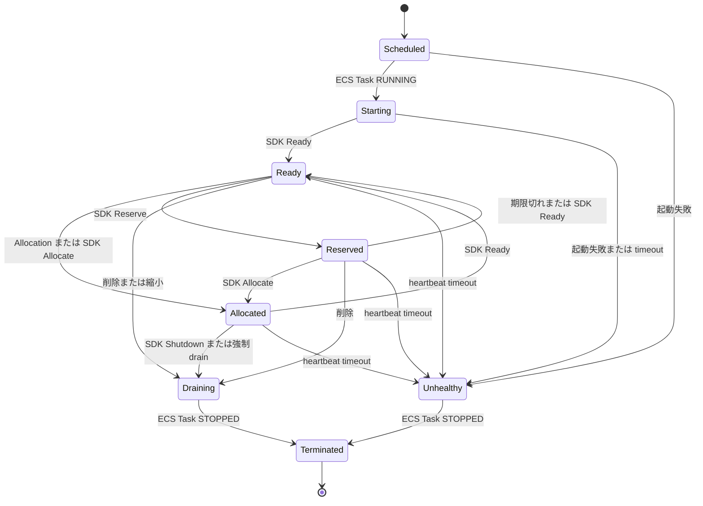

# Arena の概要

本ドキュメントは、Arena が管理するリソースと、ゲームサーバーの起動から終了までの外形的な振る舞いを説明する。

## 目的

Arena は、セッション単位で割り当てる専用ゲームサーバーを AWS ECS 上で管理する。Fleet の希望台数に合わせて ECS Task を起動し、起動済みの GameServer をマッチメーカーへ割り当て、不要または異常な Task を停止する。

Kubernetes API と Custom Resource Definition は使用しない。コントロールプレーン API は Connect、gRPC、gRPC-Web を同一の HTTP ハンドラで提供する。ゲームプロセスは同じ ECS Task 内の sidecar を介して状態を通知する。

## 用語

Arena 固有のリソースを、以下にまとめる。

| 用語 | 定義 |
| --- | --- |
| Fleet | 同一テンプレートから作成する GameServer 群と、その希望台数、更新方法、オートスケール設定 |
| GameServer | 1 個の ECS Task に対応する実行時リソース |
| Allocation | GameServer をセッションへ割り当てた記録 |
| Ready pool | 割り当て可能な GameServer を保持する Redis の派生データ |
| SDK sidecar | ゲームプロセスへローカル SDK を提供し、`arena-api` と通信するコンテナ |
| SDK Gateway | sidecar の双方向ストリームを終端する `arena-api` 内部サービス |

## 機能

Arena が提供する機能は次のとおりである。

- Fleet の作成、参照、更新、削除、台数変更
- Fleet manifest の検証、差分表示、宣言的適用
- GameServer の起動、停止、ローリング更新
- Ready GameServer の冪等な割り当てと解放
- ラベル、フィールド、Counter による割り当て候補の選択
- Buffer、Schedule、Webhook、Counter、Chain ポリシーによるオートスケール
- SDK heartbeat と ECS Task event による障害検知
- 複数リージョンへの Allocation 転送

## ライフサイクル

GameServer の基本的な状態遷移を図で表すと、次のようになる。

`Ready` は新規 Allocation の対象である。`Reserved` は Ready pool から外れるが、縮小から保護される。`Allocated` から `Ready` へ戻すと GameServer を再利用できる。

## 接続モデル

Allocation の応答には GameServer のアドレスとポートが含まれる。ゲームクライアントはその接続先へ直接通信する。ゲームトラフィック用のロードバランサは Arena のデータフローに含まれない。

コントロールプレーンと sidecar の関係、および永続データと派生データの境界は、[arena/architecture.md](arena/architecture.md) を参照。
